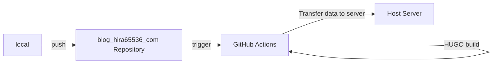

# blog_hira65536_com

 - リポジトリへプッシュすると、自動で静的ページを作成しデプロイまでしてくれます。
   - [hira65536.com](https://hira65536.com/)

- 動作イメージ

```mermaid
graph LR
A[local]
B[blog_hira65536_com Repository]
C[GitHub Actions]
D[Host Server]
A--push-->B
B--trigger-->C
C--HUGO build-->C
C--Transfer data to server-->D
```

