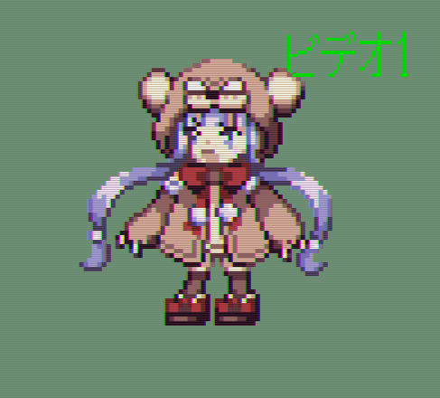

+++
author = "hira65536"
title = "AnalogTVLike_Auto"
date = "2020-09-30"
description = "画像をブラウン管画面風に加工をするソフトを作ったよ。"
categories = [
    "Software"
]
tags = [
    "PixelArt",
]
+++

<blockquote class="twitter-tweet">
例のソフト久々に更新しました。 &lt;変更内容&gt; -gifのフレーム数を設定できる。 -フレーム画像が「右上にビデオ１」に変更。 -左端に右端のデータが反映されるバグ修正 -全体の軽量化(数100MBから数10MBに…) 他、微調整など<a href="https://t.co/kgKO8LKyd8">https://t.co/kgKO8LKyd8</a> <a href="https://t.co/4DuIRoA7V4">pic.twitter.com/4DuIRoA7V4</a>
&mdash; ひら (@hira_65536) <a href="https://twitter.com/hira_65536/status/1404376180304666625?ref_src=twsrc%5Etfw">June 14, 2021</a> </blockquote>

   
### 配布場所
[https://github.com/Hira-65536/AnalogTVLike/releases/tag/v1.3.0](https://github.com/Hira-65536/AnalogTVLike/releases/tag/v1.3.0) 
[https://www.dropbox.com/AnalogTVlike_default.zip](https://www.dropbox.com/s/y6sx2xlnlfvppno/AnalogTVlike_default.zip?dl=0)  

### 注意事項

・自己責任でご使用ください。本ソフトで何か問題が起きても、制作者は責任を負いかねます。

・利用は無償有償問わず、ご自由にお使いください。

・対応している画像（動作確認済み：GIF,PNG,JPG）以外では上手く動作しない場合があります。

・gifアニメにも対応しましたが、完成ビューは出てきません。

・出力先はその画像が存在していたフォルダに出力されます。

### 使用方法
１．exeファイルを実行すると、コンソール画面（黒い画面）とエクスプローラーが開く。

２．加工したい画像を選ぶ。

３．画像が大きすぎる場合リサイズされる。（縦：1920px, 横:1080px以上のとき）

４．ポップアップウィンドウがでてきて、フレームの有り無しを選択。完成画像が表示されるので、確認したらそのウィンドウを閉じて、保存するを選ぶと完成。

５．GIFアニメの場合、フレーム有無を選択後にフレーム数を指定できます。また、完成画像は表示されません。そのあとは4番同様に保存を選択してください。

６．完成した画像は加工前の画像が入っていたフォルダに出力される。（出力前の画像名_(フレームありだったら、ここに"frame_"がはいる)output.png）

入力画像

出力画像（フレームなし）

出力画像（フレームあり）

新しいバージョンでは右上に「ビデオ１」と表記されたものがフレームになっています。

フレームはsampleフォルダの中にある、frame.pngを書き換えることで変更ができます。

（フレームの画像は入力画像に合わせて自動で変更されます。）

### setting.txtについて

数字を弄ると各閾値を変更できます。

1行目：ハーフトーン（線みたいなやつ）の濃さが変わる（０～２５５）。ここは小数を入れても切り捨てされる。

2行目：コントラストが変わる。あまり弄らない方がいいかもしれない。小数はOK

3行目：明るさ。明るい方がブラウン管を再現できるけど、やりすぎは白っぽくなってしまうので注意。小数OK

4行目：ガウスぼかしの閾値。お好みで使ってください。目安は0.8～1.8くらい。小数OK

5行目：赤っぽさ。敢えて赤っぽさを強めるために、設定している。気になる人は少し弄ってみるといいかも。小数を入れても切り捨てされる。

数字以外（大文字数字もダメ）は記述しないで。

デフォルト値（弄りすぎたときは、ここからコピペしてね）

153

0.8

1.3

1.3

10

・大きい容量のGIFで、原因不明のフリーズが発生することがあるみたいです。実行を終了させて、もう一度起動することで動作は問題なく動きます。
