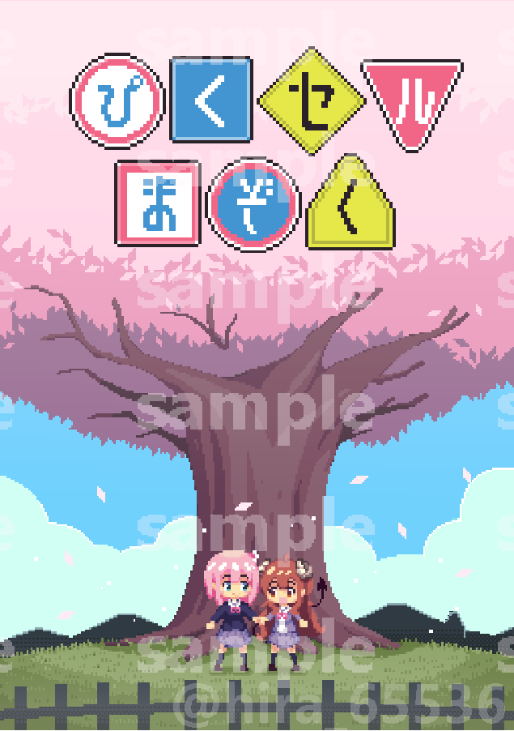

+++
author = "hira65536"
title = "ぴくセルまぞくを出しました"
date = "2022-10-04"
description = "同人誌なるものを作ってイベントにでたらしい"
categories = [
    "log"
]
tags = [
    "PixelArt"
]

+++

### 概要

人生で初めて同人即売会に参加しました。
再販予定はないですが、今後イベントでる機会があればリメイク版を刷りたい。 
購入いただいた方や、色々チェックいただいた友人、フォロワー方には大変感謝しております。

### 感想

緊張しすぎて前日全然寝れず、当日の体調最悪だったので睡眠大事。

コミケからオンリーイベまで色々と一般参加した経験はあったが、どこかサークル参加というのは憧れがあった。
あとは1冊も売れなかったら悲しいな…とかそういうことばかり考えてた。

終わってみると、心配が杞憂で色々な方に購入いただき、良い感想までいただけた。感謝しかない。

即売会に出るのは楽しいが課題も色々感じた。

#### 準備
 - 計画の見積もりが甘かった。
   - 思っていたよりも自分の作業が遅かったこと。
   - 出せる範囲で全力は出せたが、始めの絵に時間をかけ過ぎた。妥協は大事。
   - 申し込みをする前から作成、ある程度のストックを作っておくべきだった。
 - 印刷所は一番最初に決めるべきだった。
   - 1か月前くらいには決めて、投稿できると余裕ありそう。金銭的にも。
   - おたクラブさんは神。ありがとう。ちょっと表紙ズレてたけど。
 - グッズの数
   - シールとかアクキーとか考えてはいたが、時間が足りなかった。
   - 事前の調査をもっとしておくべきであった。
 - 当日に必要なもの
   - 前日にポスターつくるためにコンビニへ走った。（印刷代高い）
   - 前日にテーブルの布を買うため、ホームセンターへ走った。（意外と安い）

#### 当日
 - ポスターとかをちゃんと作るべき。ポスタースタンドとかも欲しい。
 - コイントレーは100円/500円個別に入るものを容易するべき。
 - お品書きも印刷して置くべき。（iPadを立てて誤魔化した）
 - 配置が壁だったので良かったが、そんなことは普通ないので荷物をコンパクトに。
 - 値段がわかるやつも事前に準備しておくべき。

### どんな感じ？

<blockquote class="twitter-tweet">
両隣が凄すぎて緊張しています。 <a href="https://t.co/n6ue0euNIF">pic.twitter.com/n6ue0euNIF</a>
&mdash; ひら (@hira_65536) <a href="https://twitter.com/hira_65536/status/1573134182125301760?ref_src=twsrc%5Etfw">September 23, 2022</a></blockquote> 