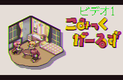

+++
author = "hira65536"
title = "画像をブラウン管風に自動加工するソフト"
date = "2020-09-30"
categories = [
    "Work_product"
]
tags = [
    "PixelArt",
    "Software"
]

+++

画像をブラウン管風に加工するソフトを作りました。

<!--more-->

## 概要

- 画像をブラウン管に表示させている風に加工を行うことができるソフト。
- 主にドット絵や低解像度の画像向け
- PNG , JPG , GIFの画像形式対応。
- GIFの場合はアニメーション形式にも対応。
- 任意の画像をフレームとして、オーバレイすることが可能。



---

### 配布場所
- Github : [https://github.com/Hira-65536/AnalogTVLike/releases/tag/v1.3.0](https://github.com/Hira-65536/AnalogTVLike/releases/tag/v1.3.0)
- DropBox : [https://www.dropbox.com/AnalogTVlike_default.zip](https://www.dropbox.com/s/y6sx2xlnlfvppno/AnalogTVlike_default.zip?dl=0)

<br>

### 免責事項

- 自己責任でご使用ください。本ソフト使用時に問題が発生しても、制作者は責任を負いかねます。

- 利用は無償有償問わず、ご自由にお使いください。利用報告も不要です。

- 対応している画像形式（GIF,PNG,JPG）以外は未対応です。

- 本ソフトウェアはMIT licenseです。

- 出力先はその画像が存在していたフォルダに出力されます。


### 使用方法
1. exeファイルを実行すると、コンソール画面（黒い画面）とエクスプローラーが開きます。
2. 加工したい画像を選択します。
3. 画像が大きすぎる場合リサイズします。（縦：1920px, 横:1080px以上のとき）
4. ポップアップウィンドウが出現し、フレームの有り無しを選択してください。
5. GIFアニメの場合、フレーム数を指定できます。
6. 完成画像が表示されるので、確認したら画像を表示しているウィンドウを閉じてください。(GIFの場合表示されません)
7. ポップアップウィンドウが再度出現します。保存する場合は「保存」を選択してください。
8. 完成した画像は加工前の画像が入っていたフォルダに出力します。
   1. 出力前のファイル名に`_output`を付与した名称のファイルを出力。
   2. フレーム画像を用意した場合は、`frame`という名称も付与されます。

- 入力画像


- 出力画像（フレームなし）


- 出力画像（フレームあり）


- フレームはsampleフォルダの中にある、frame.pngを書き換えることで変更ができます。
  - （フレームの画像は入力画像に合わせて自動で変更されます。）

### setting.txtについて

- 数字を弄ると各閾値を変更できます。
  - 1行目：ハーフトーン（線みたいなやつ）の濃さが変わる（０～２５５）。ここは小数を入れても切り捨てされます。
  - 2行目：コントラストが変わる。あまり弄らない方がいいかもしれない。浮動小数点値。
  - 3行目：明るさ。明るい方がブラウン管を再現できるけど、やりすぎは白っぽくなってしまうので注意。浮動小数点値。
  - 4行目：ガウスぼかしの閾値。お好みで使ってください。目安は0.8～1.8くらい。浮動小数点値。
  - 5行目：赤っぽさ。敢えて赤っぽさを強めるために、設定している。気になる人は少し弄ってみるといいかも。小数を入れても切り捨てされる。

- 数字以外を記述するとエラーとなり、動作が強制終了します。

- デフォルト値（弄りすぎたときは、ここからコピペしてね）

```
153
0.8
1.3
1.3
10
```

- 大きい容量のGIFで、原因不明のフリーズが発生することがあるみたいです。実行を終了させて、もう一度起動することで動作は問題なく動きます。


### 余談


WEB上で実行可能なJavaScript版を作ってみていますが、いまいち。。。
[https://hira-65536.github.io/AnalogTVlikeWeb/](https://hira-65536.github.io/AnalogTVlikeWeb/)