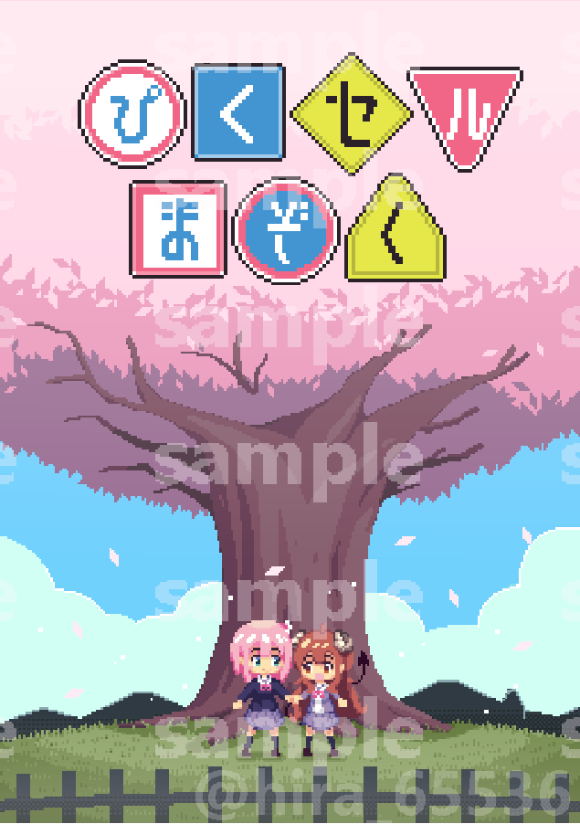

+++
author = "hira65536"
title = "ぴくセルまぞくを出しました"
date = "2022-10-04"
description = "スーパーヒロインタイム2022秋に参加しました。"
categories = [
    "log"
]
tags = [
    "PixelArt"
]

+++

スーパーヒロインタイム2022秋に参加。ぴくセルまぞくを頒布しました。

<!--more-->

### 概要

人生で初めて同人即売会に参加しました。

~~再販予定はないですが、今後イベントでる機会があればリメイク版を刷りたい。~~ 

購入いただいた方や、色々チェックいただいた友人、フォロワー方には大変感謝します。

### 感想

- サークル参加初だったが、自分の創作物を見てもらえたり、フィードバッグをもらえるのは嬉しい。
- 体調管理大事。残業続きかつ1冊も売れなかったらとかいう不安で前日も眠れず。。。

- 周りのサークルの人がいい人ばかりで良かった。私のコミュニケーション下手だったけど。

---

即売会に出てよかった半面、今回課題点も色々感じた。

#### 準備
 - 作成日程の見積もりの甘さ
   - 思っていたよりも自分の作業が遅かったこと。
   - 出せる範囲で全力は出せたが、始めの絵に時間をかけ過ぎた。妥協は大事。
   - 申し込みをする前から作成、ある程度のストックを作っておくべきかも。
 - 印刷所
   - 1か月前くらいには決めて、投稿できると急いで探さずに済む。
   - 納期2週間以内のおたクラブさんは神。ありがとう。
   - オンデマンド印刷でも全然綺麗だったので満足。
- 納品前の確認
  - チェック不足で一番大事な表紙が微妙にずれてしまった。確認大事。
 - グッズの数
   - シールとかアクキーとか考えてはいたが、時間が足りなかった。
   - 事前の調査をもっとしておくべきであった。
 - 当日に必要なもの
   - 前日にポスターつくるためにコンビニへ走った。（印刷代高い）
   - 前日にテーブルの布を買うため、ホームセンターへ走った。（意外と安い）

#### 当日
 - あれば嬉しいもの
    - ポスターをちゃんと作りたい。ポスタースタンドも欲しい。
    - コインケースは100円と500円それぞれのケースを用意する。
    - お品書きも印刷して置くべき。（今回はiPadを立てて誤魔化した）
    - 商品の値段についてもわかりやすいように準備しておくべき。
 - 荷物
    - 今回は配置が壁だったので良かったが、今後は荷物をコンパクトに展開できるようにしたい。
 - 挨拶
    - 周りのサークル様に挨拶しよう。色々とお話し聞けて面白いかもしれない。

### どんな感じ？

- 最低限の形にはなってたと思う。

<blockquote class="twitter-tweet">
両隣が凄すぎて緊張しています。 <a href="https://t.co/n6ue0euNIF">pic.twitter.com/n6ue0euNIF</a>
&mdash; ひら (@hira_65536) <a href="https://twitter.com/hira_65536/status/1573134182125301760?ref_src=twsrc%5Etfw">September 23, 2022</a></blockquote> 