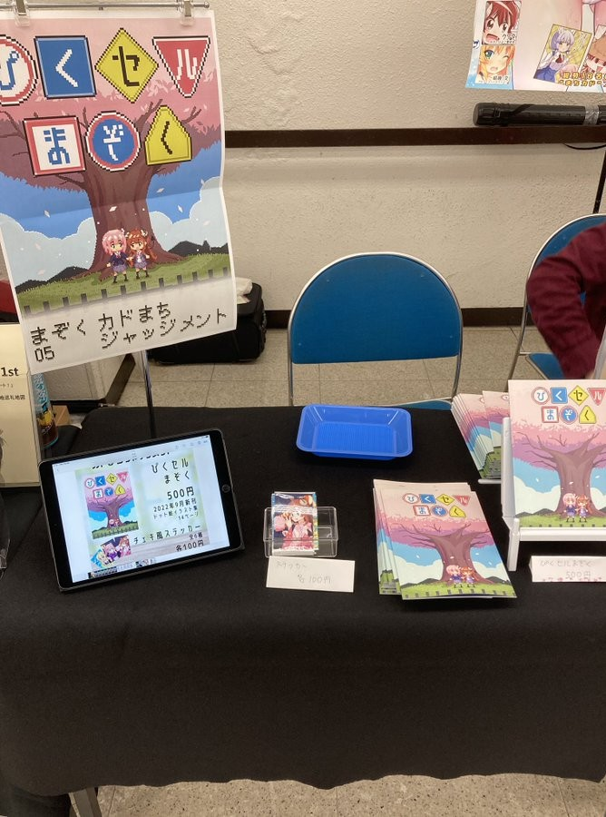

+++
author = "hira65536"
title = "ぴくセルまぞくを出しました"
date = "2022-10-04"
description = "スーパーヒロインタイム2022秋に参加しました。"
categories = [
    "log"
]
tags = [
    "PixelArt"
]

+++

桜ケ丘ばんがいち五番地(スーパーヒロインタイム2022秋)に参加。ぴくセルまぞくを頒布しました。

<!--more-->

### 概要

人生で初めて同人即売会に参加しました。

~~再販予定はないですが、今後イベントでる機会があればリメイク版を刷りたい。~~ 

購入していただいた方や、当日差し入れくれた友人、色々チェックいただいた方々には大変感謝いたします。

### 感想

- サークル参加初で右も左もわからなかったが、意外と形にはなった。
- 目の前で自分の創作物を見てくれる人が居たり、直接感想をもらう経験は初めてで、とても貴重な体験になった。
- みんなのまちカドまぞくへの愛を感じることができた。

---

即売会に出てよかった半面、今回課題点も色々感じた。

#### 準備
 - 作成日程の見積もりの甘さ
   - 思っていたよりも自分の作業が遅かったこと。
   - 出せる範囲で全力は出せたが、始めの絵に時間をかけ過ぎた。ある程度の妥協も大事かもしれない。
   - 申し込みをする前から作成、ある程度のストックを作っておくべきかも。
 - 印刷所
   - 1か月前くらいには決めて、投稿できると良かった。
   - それでも、納期2週間以内のおたクラブさんは神だった。ありがとう。
   - オンデマンド印刷でも全然綺麗だったのでかなり満足。
- 納品前の確認
  - チェック不足で一番大事な表紙が微妙にずれてしまった。確認大事。
 - グッズの数
   - シールとかアクキーとか考えてはいたが、時間が足りなかった。
   - 事前にもっと準備をしておくべきだった。
 - 当日に必要なもの
   - 前日にポスターつくるためにコンビニへ走った。（印刷代高い）
   - 前日にテーブルの布を買うため、ホームセンターへ走った。（意外と安い）

#### 当日
 - あれば嬉しいもの
    - ポスターをちゃんと作りたい。ポスタースタンドも欲しい。
    - コインケースは100円と500円それぞれのケースを用意する。
    - お品書きも印刷して置くべき。（今回はiPadを立てて誤魔化した）
    - 商品の値段についてもわかりやすいように準備しておくべき。
 - 荷物
    - 今回は配置が壁だったので良かったが、今後は荷物をコンパクトに展開できるようにしたい。
 - 挨拶
    - 周りのサークル様に挨拶しよう。色々とお話し聞けて面白いかもしれない。

### どんな感じ？

- 最低限の形にはなってたと思う。

