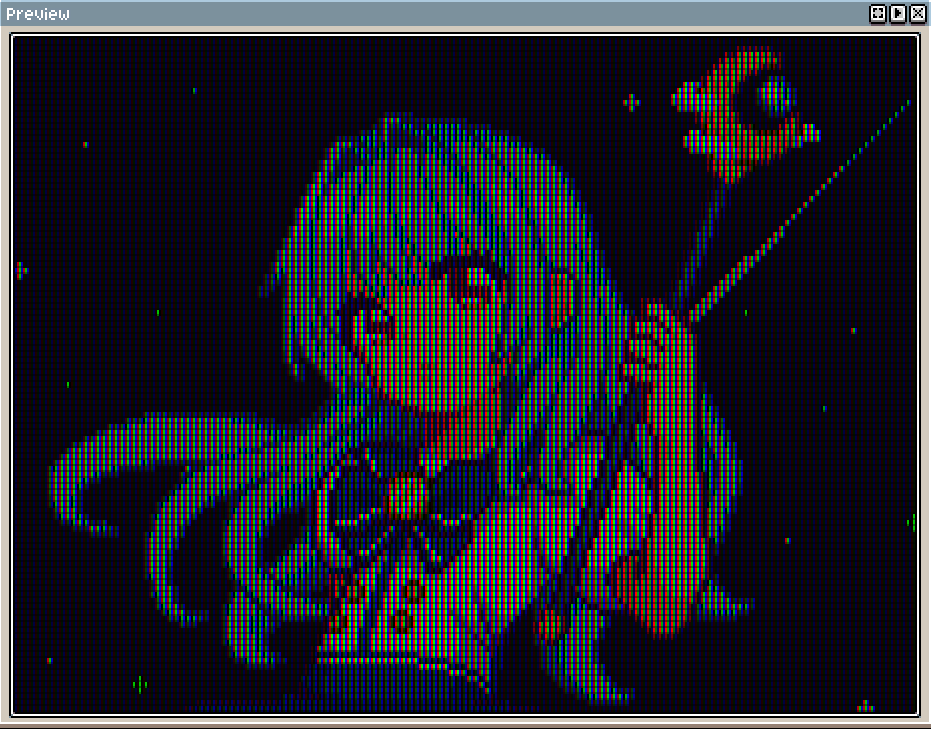

+++
author = "hira65536"
title = "AsepriteのスクリプトでCRT風にする"
date = "2023-03-12"
description = ""
categories = [
    "Work_product"
]
tags = [
    "PixelArt",
    "Aseprite"
]

image = "image_crt.png"

+++

Asepriteのスクリプトでブラウン管(CRT)風にする。

<!--more-->

### 概要

 - Asepriteで動作するスクリプト
 - 本スクリプトを使用すると、ドット絵をCRTっぽく表示をすることができます。

 - 配布 : [Aseprite_CRTConverter](https://github.com/Hira-65536/Aseprite_CRTConverter)

### メモ

- ドット絵サイズを3倍にして、1ドットのRGB値から赤、緑、青の値を取り出して再配置している。

- 液晶面に表示させてモアレっぽい現象を起こせる。何かに使えるか...

↓ blenderでテレビの3Dモデルに本スクリプトで加工したイラストを張り付けた様子。

