+++
author = "hira65536"
title = "おさんぽログ 沼津編"
date = "2025-02-02"
description = ""
categories = [
    "log"
]

+++

今更ながらAqoursにハマったので、聖地巡礼と美味しい海鮮を求め沼津へ行ってきたという話

<!--more-->

### 隙自語

今回の訪問時点での、私の知識としてはアニメを観た(今更)くらい。なんで今まで観てなかったのが疑問に感じるほど、好きな作品だった。ストーリーが良かった。曲も良かった。キャラクターも大好き。

この作品に出会うきっかけを作ってくれた異次元フェスありがとう。

### 12時 沼津駅着

本当は10時くらいには着く予定だったのに...寝坊しました。

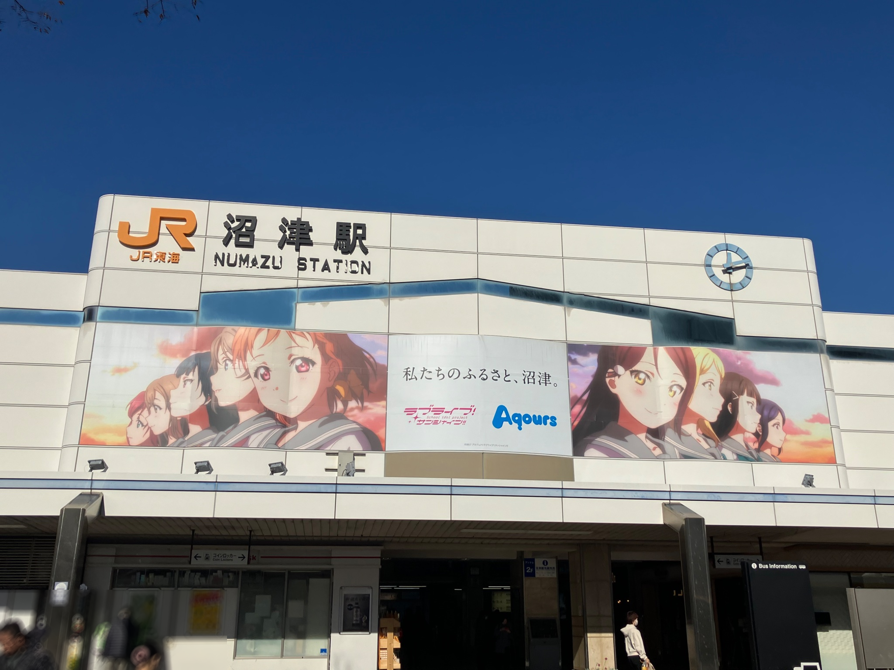

駅前はAqoursの面々がお出迎えしてくれる。訪問日は平日だったので、同じ目的の観光客は少ない感じ。

というか、町全体至る所にAqoursのキャラクターがいる。すごい。

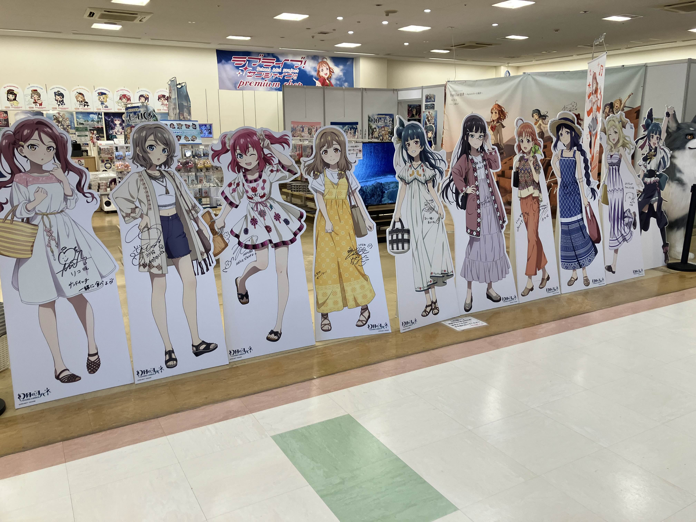

プレミアムショップ

みんなかわいい。店内、俺と店員さんだけで少し気まずい空気が流れる。

もともとアイマスPだった癖に、こういうショップに訪れたことがなかったので、謎に緊張してしまう。

### 13時ごろ 沼津周辺

歩いて沼津港まで

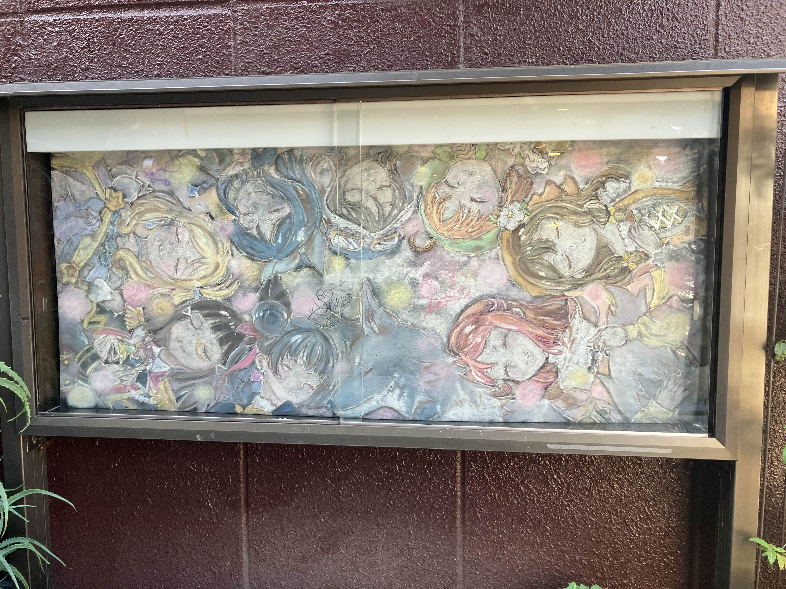

街中で見かけた黒板アート(？)すごい。

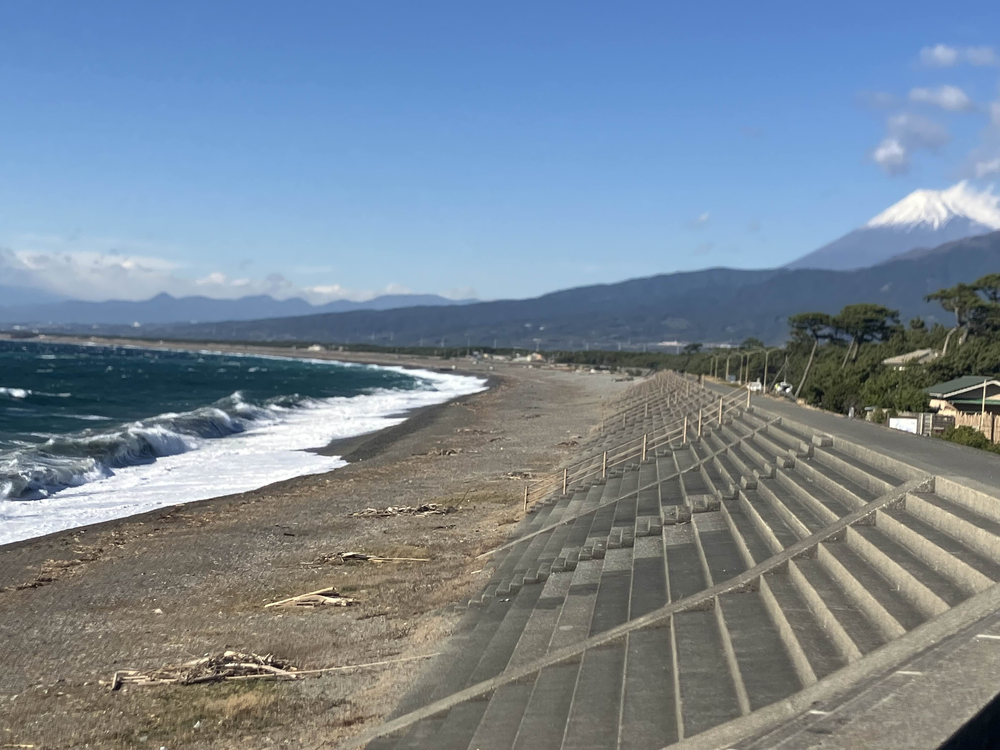

海。風強すぎる。ピントおかしい。

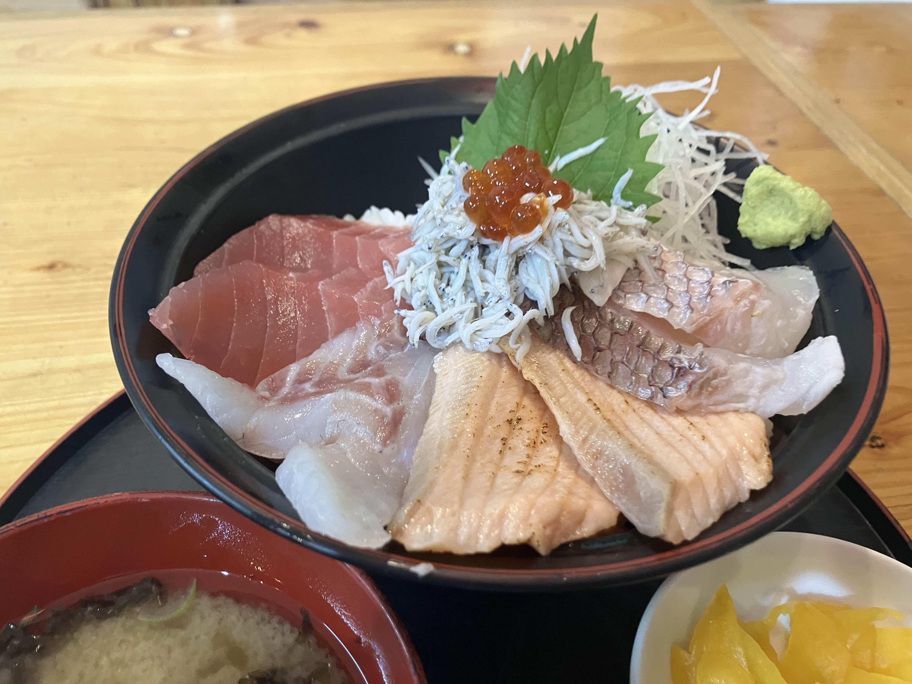

沼津港の海鮮丼。どうせだったら山盛りの海鮮丼を頼めばよかったかも。。。味はとてもおいしい。

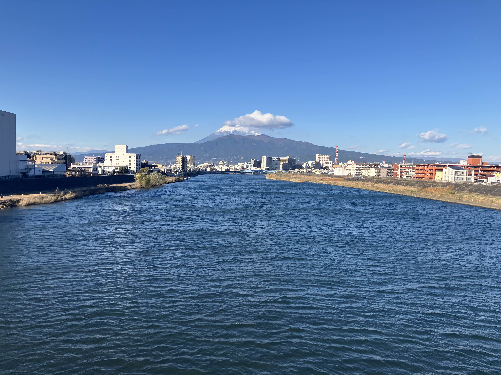

これは狩野川から見える富士山。

### 14時ごろ あわしまマリンパーク

バスであわしまマリンパークへ (交通機関使ったら散歩じゃないというツッコミはなしで...)

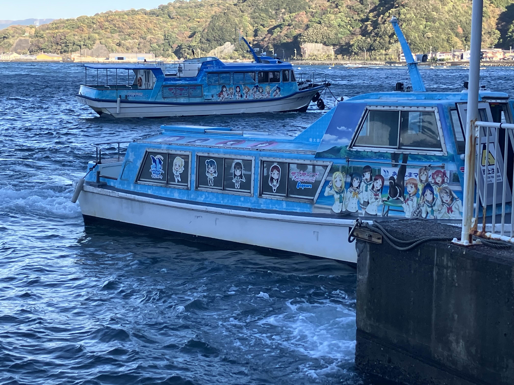

あわしまマリンパークの船。

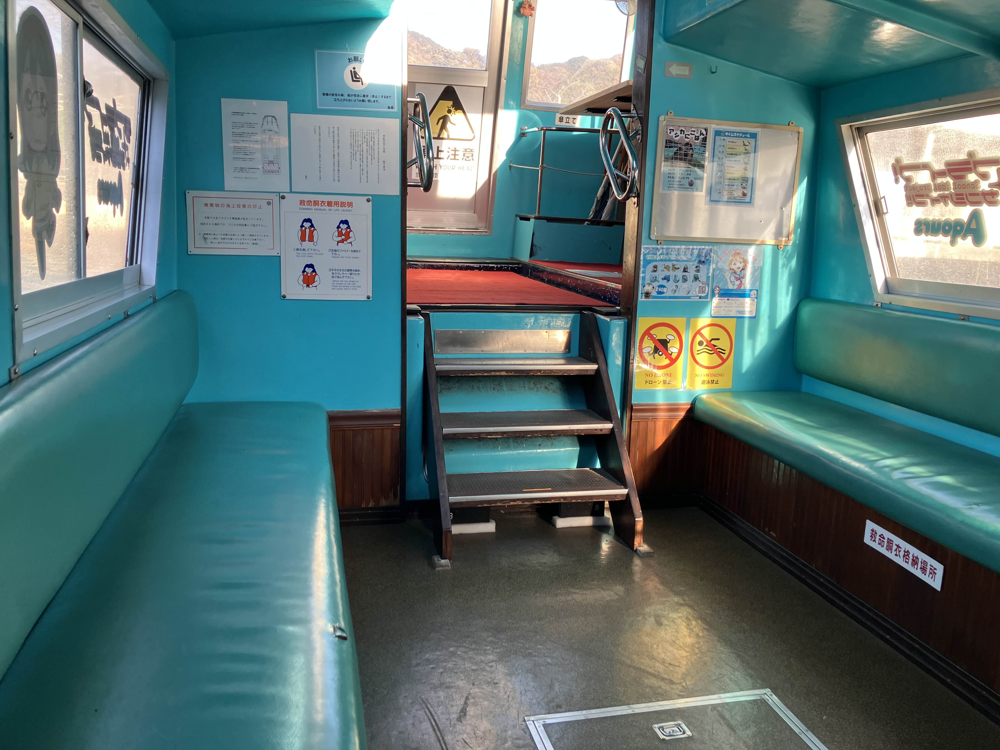

船内。貸し切り状態だったので、船内のサインも写真でパシャパシャと...(ここには載せないけど)

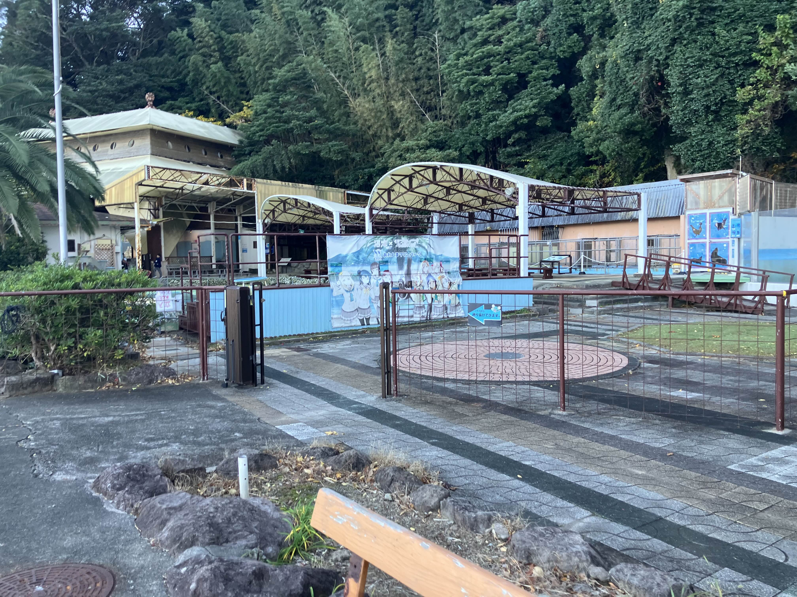

時代を感じる風景。直近で一度閉園した過去があると聞いて驚き。ありがとう復活してくれて。

写真は無いが、水族館もカエル館もかなり満足度高い展示だった。個人的にはモウドクフキヤガエルの実物を初めて拝めてテンション高い。

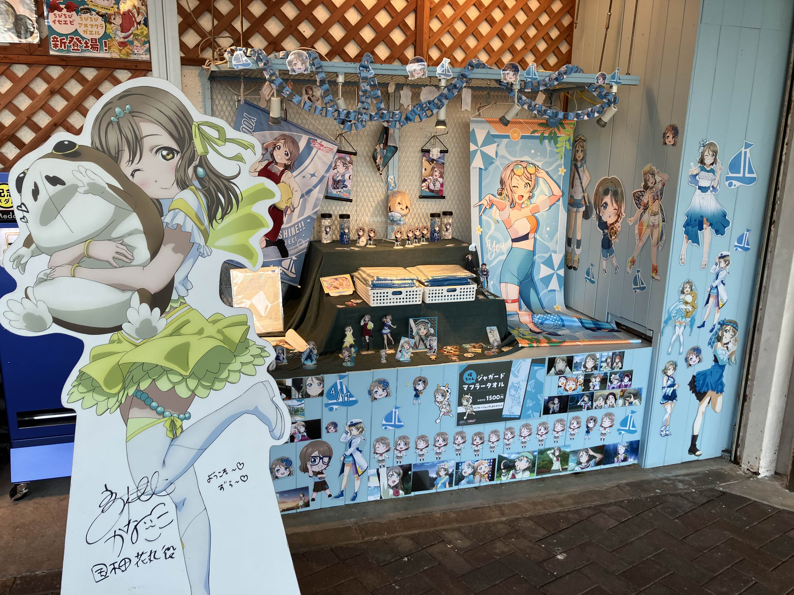

同じくあわしまマリンパーク内。熱い曜ちゃん推し。すごい。愛だね。

ようこそ～♡ずら～♡

物語中に出てきたオブジェクトが現実に存在しているのいいよね。ちゃんとバス路線図もある。

### 17時ごろ  阿蘭陀館下河原店

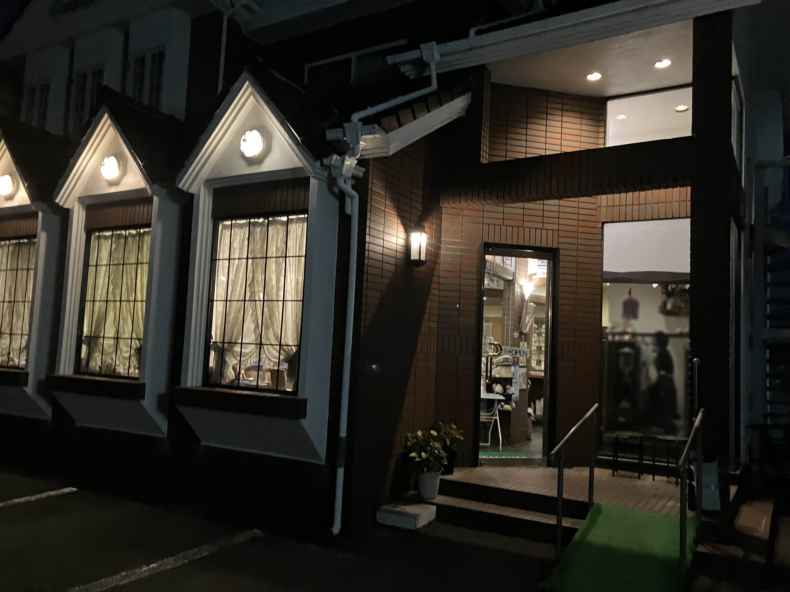

内浦からバスで沼津に。阿蘭陀館下河原店は曜ちゃんの実家モデルになったとか。

...アニメ1期 11話で、千歌ちゃんが自転車で曜ちゃんの家まで来たシーンあるけど、思っていた以上に距離ある。

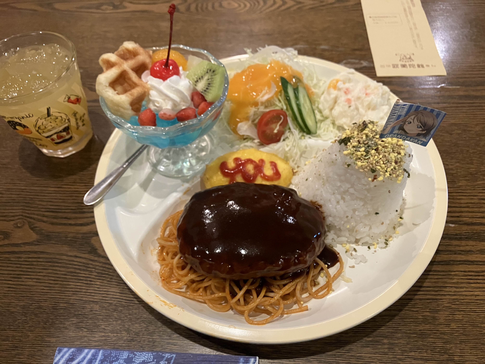

曜ちゃんの家のハンバーグ。お値段は1100円くらいだった(気がする)。

ワンプレートでお腹いっぱいになったので、アニメコラボのメニューでこれはお得。

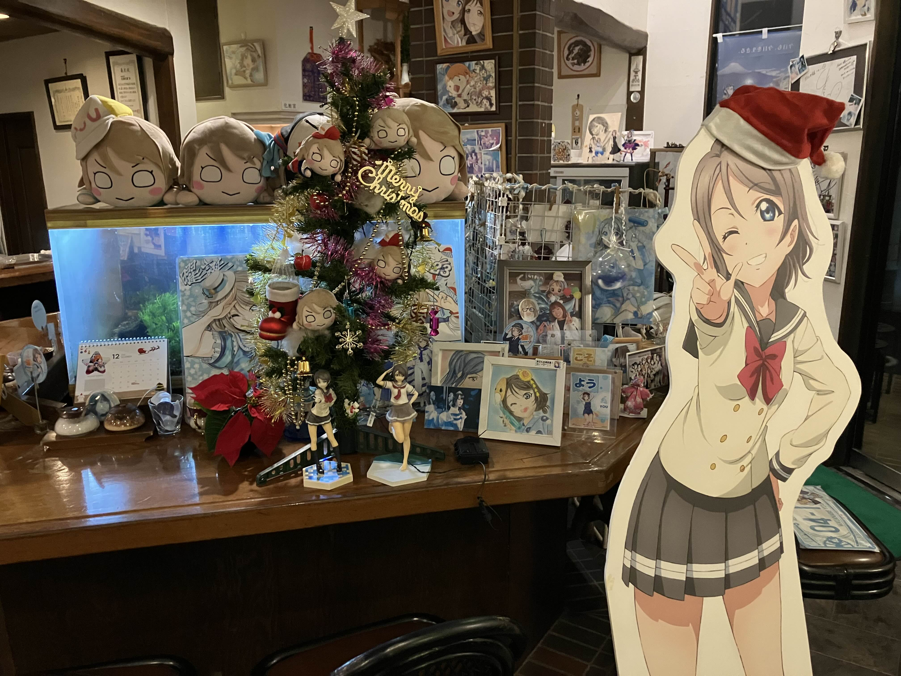

店員さんに声かけたら自由に撮影していいとのことで、パシャパシャと。。。

訪問が12月だったので、曜ちゃんツリーが飾られていた。愛だね。

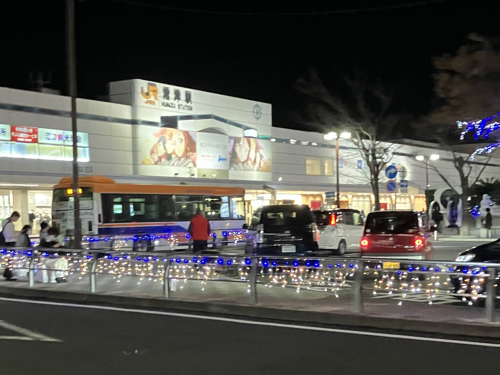

夜の沼津駅。ボケボケの写真しかなかった。

### 感想

全盛期に比べると客足は落ち着いているのか、観光地をゆっくり巡ることができた気がする。

沼津から内浦にかけて巡る中で、「Aqoursは本当に愛されているんだな」と強く感じた。観光地や街全体でAqoursと地元を一緒に盛り上げようとしている様子が伝わってくるし、写真に収めた場所以外でもたくさんの“愛”を感じる瞬間があった。訪れて本当によかったと思える場所だった。

全盛期を過ぎたタイミングで興味を持ち始めた私のような人間でも、当時の盛り上がりを少しでも感じられる場所が残っているのはありがたい。そして、地元の人たちに今なお愛されている光景を見るだけで胸が熱くなる。

今年（2025年）、AqoursのFinalライブが開催されるが、それ以降は少しずつコンテンツ展開も減っていくのだろうか。
もしかすると、沼津やその周辺の風景もこれから先、大きく変わってしまうかもしれない。

でも、私がもっと歳を重ねたとき、再び沼津を訪れ、Aqoursの存在をわずかでも感じられたら素敵だと思う。

こう書くと少し退廃的な文章に思えるが……近いうちにまた行くだろう。いや、きっと行く。